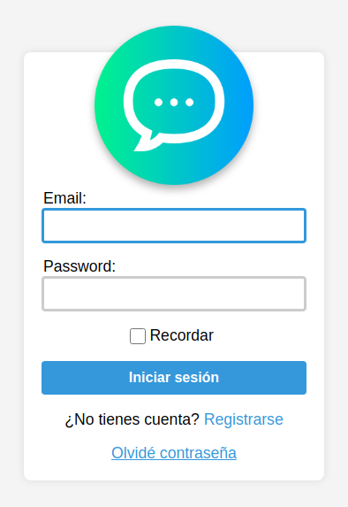

# Feelchat.me: Aplicación de Chat con Análisis de Sentimiento

Feelchat.me es una innovadora aplicación de mensajería al estilo WhatsApp, diseñada para enriquecer la interacción entre usuarios mediante el análisis de sentimiento de los mensajes. Esta funcionalidad, opcionalmente activable por el usuario, añade un icono al lado de cada mensaje que refleja el sentimiento detectado, proporcionando una capa adicional de contexto emocional a las conversaciones.

## Capturas de pantalla

<div style="width: 50%; margin: auto; text-align: center;">
  <h3>Pantalla de login</h3>
  
</div>
<br>

**Nota**: Pendiente de añadir mas capturas conforme el desarrollo del proyecto vaya avanzando.

## Características Principales

- **Mensajería en Tiempo Real:** Permite a los usuarios comunicarse instantáneamente.
- **Análisis de Sentimiento:** Analiza el sentimiento de los mensajes y lo representa con un icono.
- **Opción de Activar/Desactivar Análisis:** Los usuarios pueden elegir si desean o no el análisis de sentimiento.
- **Seguridad:** Todos los datos son encriptados para garantizar la privacidad y seguridad de las conversaciones.

## Tecnologías Utilizadas

La aplicación está construida utilizando un conjunto de tecnologías modernas y eficientes:

- **Frontend:** Svelte para una interfaz de usuario dinámica y reactiva.
- **Backend:** Flask, un microframework de Python, para manejar las solicitudes del lado del servidor.
- **Proxy/Reverse** Proxy: nginx para manejar solicitudes HTTP, servir contenido estático y actuar como intermediario entre el cliente y el servidor de aplicaciones.
- **Base de Datos:** MongoDB, una base de datos NoSQL, para almacenar los datos de usuarios y mensajes.
- **Análisis de Sentimiento:** Kafka, como sistema de mensajería, para procesar los mensajes y analizar su sentimiento.
- **Seguridad:** Encriptación de datos para asegurar la privacidad de los mensajes.

## Configuración del Proyecto

### Requisitos Previos

Antes de comenzar, asegúrate de tener instalado Python, Flask, MongoDB, Kafka, y las librerías necesarias para Flask y MongoDB en tu entorno de desarrollo.

Para incluir detalles sobre el uso y configuración del contenedor Docker para MongoDB en tu archivo `README.md`, puedes agregar la siguiente sección:

---

## Configuración de MongoDB con Docker

Para facilitar la configuración y despliegue de la base de datos MongoDB, utilizamos Docker. Esto asegura un entorno consistente y aislado para la base de datos, independientemente del sistema operativo del host.

### Requisitos Previos

- **Docker:** Asegúrate de tener Docker instalado en tu sistema. Para instalar Docker, sigue las instrucciones en la [página oficial de Docker](https://docs.docker.com/get-docker/).

### Iniciar MongoDB con Docker

1. **Crear y ejecutar un contenedor MongoDB:**

   Abre una terminal y ejecuta el siguiente comando para crear y ejecutar un contenedor de MongoDB llamado `mongo-server`. Este comando también mapea el puerto 27017 del contenedor al puerto 27017 de tu máquina local, permitiendo conexiones a la base de datos desde tu aplicación.

   ```sh
   docker run --name mongo-server -d -p 27017:27017 mongo
   ```

   Si necesitas habilitar la autenticación en MongoDB, revisa la sección de [Habilitando la Autenticación](#habilitando-la-autenticación) más abajo.

2. **Verificar que el contenedor está ejecutándose:**

   Puedes verificar que el contenedor de MongoDB está corriendo correctamente con el siguiente comando:

   ```sh
   docker ps
   ```

   Deberías ver `mongo-server` en la lista de contenedores activos.

### Habilitando la Autenticación

Para entornos de producción, es recomendable habilitar la autenticación en MongoDB. Puedes hacerlo creando un usuario administrador dentro de MongoDB y reiniciando el contenedor con la autenticación habilitada. Consulta la documentación oficial de MongoDB para [administrar usuarios y autenticación](https://docs.mongodb.com/manual/tutorial/manage-users-and-roles/).

### Conexión a MongoDB desde la Aplicación

Una vez que tu contenedor de MongoDB esté corriendo, puedes conectar tu aplicación a MongoDB utilizando la siguiente URI de conexión:

```python
app.config['MONGO_URI'] = "mongodb://localhost:27017/feelchat_db"
```

Asegúrate de reemplazar `feelchat_db` con el nombre de tu base de datos específica.

---

# Desarrollo Local

### Configuración del Entorno de Desarrollo

#### Backend (Flask)

1. Crea un entorno virtual para Python:
   ```sh
   python3 -m venv venv
   ```
2. Activa el entorno virtual:
   - En Windows: `venv\Scripts\activate`
   - En Unix o macOS: `source venv/bin/activate`
3. Instala las dependencias:
   ```sh
   pip install -r requirements.txt
   ```

#### Frontend (Svelte)

1. Navega al directorio del frontend e instala las dependencias de Node.js:
   ```sh
   cd frontend
   npm install
   ```

### Ejecución en Desarrollo

- **Backend:** Ejecuta `python app.py` desde el directorio raíz para iniciar el servidor Flask.
- **Frontend:** Ejecuta `npm run dev` en el directorio del frontend para iniciar el servidor de desarrollo de Svelte.

## Producción

### Construcción del Frontend

1. Construye la aplicación Svelte para producción:
   ```sh
   npm run build
   ```
   Esto genera el directorio `public` o `build` con los archivos estáticos.

### Configuración de nginx

1. Instala nginx en tu servidor de producción.
2. Configura un bloque de servidor en nginx para tu aplicación. Aquí hay un ejemplo básico:
   ```nginx
   server {
       listen 80;
       server_name example.com www.example.com;

       location / {
           root /path/to/your/svelte/app/build;
           try_files $uri $uri/ /index.html;
       }

       location /api {
           proxy_pass http://localhost:5000;
           proxy_set_header Host $host;
           proxy_set_header X-Real-IP $remote_addr;
           proxy_set_header X-Forwarded-For $proxy_add_x_forwarded_for;
           proxy_set_header X-Forwarded-Proto $scheme;
       }
   }
   ```
   Asegúrate de reemplazar `/path/to/your/svelte/app/build` con el camino real al build de tu aplicación Svelte y ajusta la configuración de `proxy_pass` según sea necesario para tu aplicación Flask.

3. Reinicia nginx para aplicar los cambios.

### Despliegue

- Asegúrate de que tu base de datos MongoDB y cualquier otro servicio (como Kafka) estén configurados y ejecutándose en tu entorno de producción.
- Despliega tu aplicación Flask y los archivos estáticos de Svelte según la configuración anterior.
- Considera usar certificados SSL (por ejemplo, de Let's Encrypt) para habilitar HTTPS en tu dominio.

## Contribuciones

## Seguridad

Este proyecto toma en serio la seguridad de los datos. Todos los mensajes son encriptados para garantizar que solo los participantes de la conversación puedan acceder al contenido de los mensajes.

## Licencia

Este proyecto está licenciado bajo la Licencia MIT. Consulta el archivo `LICENSE` en este repositorio para obtener más detalles.

Este README proporciona una visión general completa de tu proyecto, desde su propósito y características principales hasta detalles técnicos sobre su configuración y ejecución. Asegúrate de adaptar las instrucciones de configuración y ejecución según corresponda a tu entorno específico y a cualquier dependencia adicional que tu proyecto pueda tener.